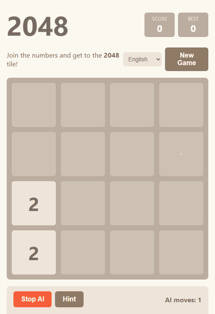

<div align="center">

# Auto-2048

**2048 in the browser with a tunable Expectimax AI that plays for you.**

[](https://mrdadado.github.io/Auto-2048/)

[](LICENSE)


[](https://github.com/MrDaDaDo/Auto-2048/stargazers)



<sub>The AI playing on autopilot (search depth 3, sped up 3×)</sub>

</div>

A dependency-free browser version of **2048** with a built-in **Expectimax AI** that can play the game for you or suggest your next move. Just open the page and hit **AI Autoplay**.

> If you find this project fun or useful, please consider giving it a ⭐ — it really helps!

## Features

- **Classic 2048 gameplay** with smooth sliding, spawn and merge animations
- **Keyboard and touch controls**: arrow keys / WASD on desktop, swipe on mobile
- **AI Autoplay**: lets the AI play continuously
- **Hint**: shows the AI's suggested next move
- **Tunable AI** from the in-page settings panel:
  - Search depth
  - Number of threads (parallel search with Web Workers)
  - Delay per move and animation duration
  - Heuristic weights: empty cells, monotonicity, smoothness, max tile, corner
- **Multilingual UI**: English, 繁體中文, 简体中文, 日本語, 한국어 (auto-detected from the browser, selection remembered)
- **Best score** saved in `localStorage`

## Getting Started

No build step or dependencies are required.

1. Clone the repository:
   ```bash
   git clone https://github.com/MrDaDaDo/Auto-2048.git
   ```
2. Open `index.html` in a modern browser.

> Multi-threaded search uses Web Workers created from a Blob URL. If workers are unavailable, the AI automatically falls back to single-threaded search.

## How the AI Works

The AI uses **Expectimax search**:

- **Max nodes** try each of the four moves and pick the best.
- **Chance nodes** average over every empty cell and new tile (2 with 90% probability, 4 with 10%).
- Branches with very low cumulative probability are pruned and evaluated directly.
- Results are cached per search to avoid re-evaluating repeated positions.

Leaf boards are scored with a weighted heuristic:

| Term | Meaning |
| --- | --- |
| Empty cells | More free space is better (`log(empty + 1)`) |
| Monotonicity | Rows and columns should increase or decrease consistently |
| Smoothness | Neighboring tiles should have similar values |
| Max tile | Rewards higher tiles |
| Corner | Rewards keeping the largest tile in a corner |

For deeper searches, root moves are split across multiple Web Workers to speed things up.

## Project Structure

```
index.html   Page layout and styles
game.js      Game logic, rendering, input and AI controls
ai.js        Expectimax AI and Web Worker parallelization
i18n.js      Translations and language switching
```

## License

Released into the public domain under [The Unlicense](LICENSE).
